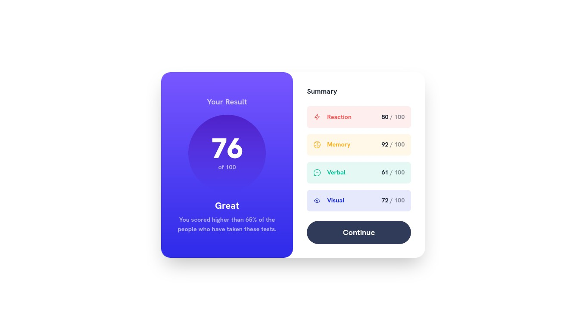

# Frontend Mentor - Results summary component solution

This is a solution to the [Results summary component challenge on Frontend Mentor](https://www.frontendmentor.io/challenges/results-summary-component-CE_K6s0maV). Frontend Mentor challenges help you improve your coding skills by building realistic projects. 

## Table of contents

- [Overview](#overview)
  - [The challenge](#the-challenge)
  - [Screenshot](#screenshot)
  - [Links](#links)
- [My process](#my-process)
  - [Built with](#built-with)
  - [What I learned](#what-i-learned)
  - [Useful resources](#useful-resources)
- [Author](#author)

## Overview

### The challenge

Users should be able to:

- View the optimal layout for the interface depending on their device's screen size
- See hover and focus states for all interactive elements on the page

### Screenshot

### Links

- Solution URL: [Github](https://github.com/abyanfalah/frontend-mentor-result-summary)
- Live Site URL: [Netlify](https://abyanf-fm-result-summary.netlify.app/)

## My process
Started with just creating the 2 main sections and all the text without any style, i utilize Vue for the summary aspects so i can just iterate through it. Then i apply the layout with flexbox. Setting the colors from the style guide as custom colors in tailwind configuration. And finally applying the layout for bigger screen using tailwindcss.

### Built with

- Flexbox
- Mobile-first workflow
- TailwindCSS

### What I learned

I've been learning web backend development all this time, so frontend stuff is still a new thing to me. In this challenge i practiced mobile-frist workflow and applying responsive design, and most importantly my slicing skill is getting better. Thanks to TailwindCSS i don't have to deal with css directly.

### Useful resources

- TailwindCSS documentation, because i'm currently learning to use it.
- Stack Overflow, because... Stack Overflow.
- Vue documentation. I love Vue.

## Author

- Frontend Mentor - [@abyanfalah](https://www.frontendmentor.io/profile/abyanfalah)
